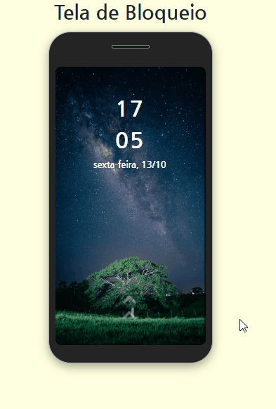

# Tela de Bloqueio - Smartphone

## O Projeto

Este, é mais um projeto que estou criando, focando na lógica. Ele consiste em simular a tela de bloqueio do meu próprio smartphone.

## Tecnologias utilizadas
- HTML
- CSS
- Javascript

### Detalhes do projeto

1. Inseri função de data e hora:
- implementada a função `showDateAndTime()` para manter a exibição atualizada de data, horas e minutos. Isso proporciona ao usuário uma experiência em tempo real.

2. Icone de seta de rolagem:
- Foi adicionado um ícone de seta para estimular o usuário a rolar a tela. Isso marca o início do processo de desbloqueio do smartphone.

3. Definição da senha de desbloqueio:
- Ao rolar a seta, a função `setPassword()` é chamada para justamente, fazer a definição da senha __apenas__ com a condição, da sequencia numérica, conter 8 dígitos. 

4. Validação da senha de desbloqueio:
- Agora, o usuário digita no teclado numérico do celular, a sequência que acabara de definir, para desbloqueio.
- Quando o usuário digita os 8 números, a função `passwordTesting()` é chamada.
- Essa função compara a senha definida de desbloqueio, com a senha digitada. Se verdadeiro, o smartphone é desbloqueado. Se falso, chama a função `excluirSenha()`, dentro de um loop for, até que seja apagado todos os números digitados, para poder recomeçar a digitação da senha. 

4. Exclusão de senha e interatividade do botão:
- A função `excluirSenha()`,  é vinculada ao evento de click, mas __APENAS__ se o usuário tiver digitado ao menos um número.
- Caso o usuário ainda não tenha digitado nenhum número, o evento de click para chamar a função `excluirSenha()`, é removido.

### Clean Code

Este projeto utiliza uma estrutura organizada em módulos para manter o código limpo e modular. Cada funcionalidade ou conjunto de funcionalidades relacionadas é agrupado em um módulo separado. Isso torna o código mais fácil de gerenciar.
Os módulos do projeto estão organizados da seguinte maneira:

- `showDateandTime.js:` Este módulo é responsável por atualizar continuamente a data e a hora exibidas na tela de bloqueio.
- `passwordData.js:` Este módulo, trata da definição da senha pelo usuário.
- `passwordTesting.js:` Este módulo, faz a validação da senha digitada pelo usuário. Ele inclui funções como a exclusão de dígitos, para recomeçar a tentativa de desbloqueio.

### Demonstração

